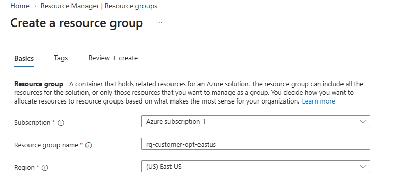
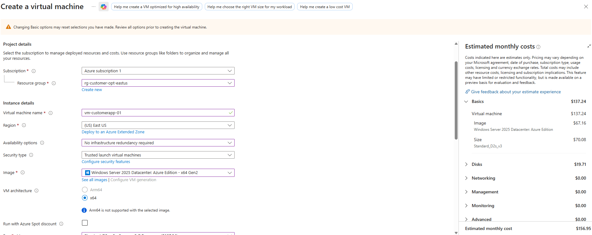
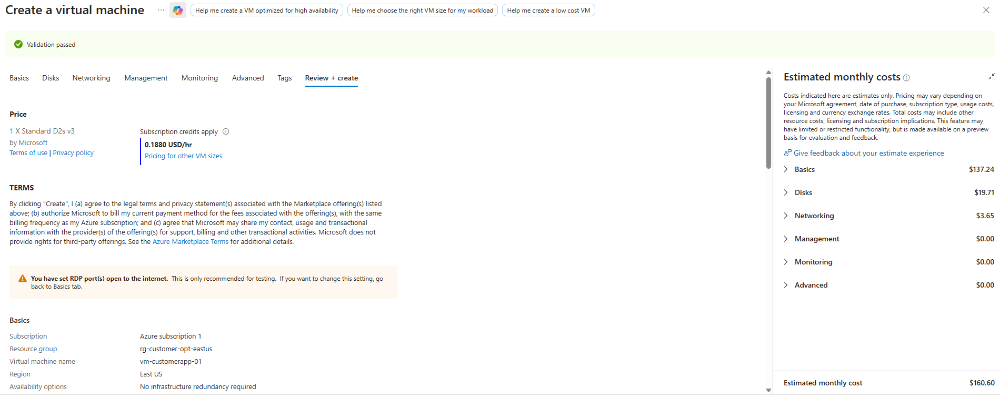
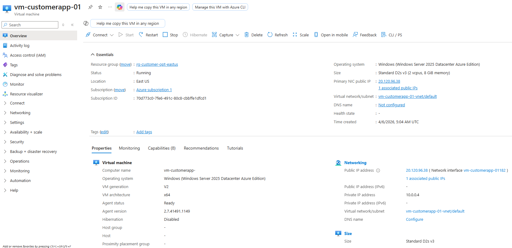
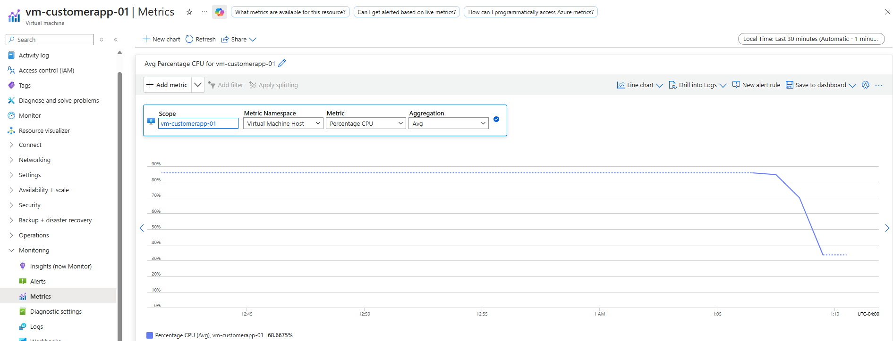
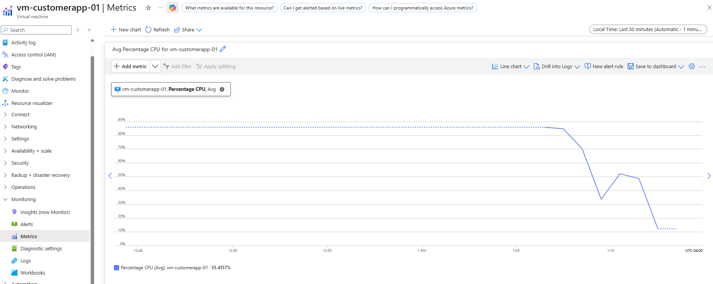

# Azure VM Performance Optimization Project

## Overview
This project simulates a real-world customer cloud environment in Microsoft Azure. The goal was to deploy a virtual machine, monitor performance using Azure Monitor, identify inefficiencies, and provide business-focused optimization recommendations.

---

## Environment Setup
- Created a Resource Group
- Deployed a Windows Virtual Machine
- Configured networking and public access
- Enabled monitoring via Azure Monitor

---

## Monitoring & Analysis
Using Azure Monitor, CPU utilization was analyzed over time.

### Key Observation:
- Sustained CPU usage between 80–85%
- Performance fluctuations indicating instability

---

## Issue Identified
The virtual machine experienced high CPU utilization, which could lead to performance degradation and poor user experience.

---

## Root Cause
- Insufficient compute resources for workload demand
- Lack of scaling or optimization

---

## Recommendations
- Upgrade VM size to increase CPU capacity
- Implement autoscaling where applicable
- Optimize workload distribution
- Set up monitoring alerts for proactive detection

---

## Business Impact
- Improved performance and responsiveness
- Reduced downtime risk
- Better customer experience
- Fewer support escalations

---

## Customer Communication Example
"We identified elevated CPU utilization impacting your system performance. We recommend scaling your VM resources or optimizing workload distribution to ensure consistent performance."

---

## Screenshots

### Resource Setup

### Deployment

### Monitoring

#### CPU Baseline

#### CPU Variation / Performance Fluctuation

